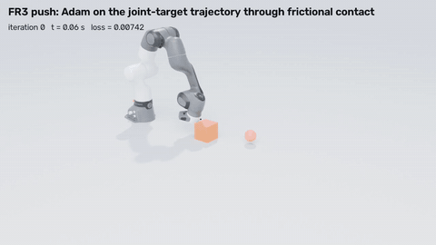
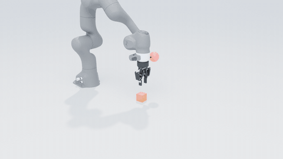
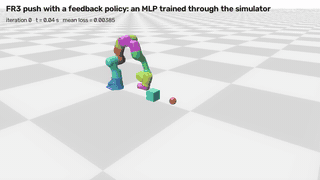
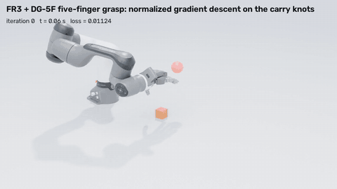
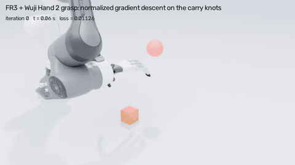
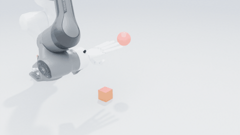
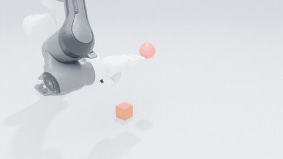
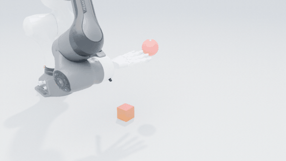
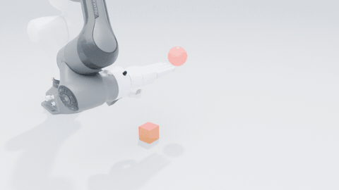

# SuperDex Physics

[SuperDex Physics](https://facebookresearch.github.io/project_superdex/physics/) is a
contact-first physics engine purpose-built for tactile manipulation, and applicable wherever
stable contact and accurate sensing matter. This is the simulation backbone of Project
SuperDex.

Provides the `superdex.physics` package: the physics simulation runtime, the viewer, and
the scene/asset utilities.

The published wheel does not carry the debugger GUI client or the mesh CLI helper, so
`superdex.physics.debugger` and `superdex.physics.mesh` are unavailable unless you build
from source. Remote debugging still works: `DebugServer` is part of the core runtime.

```bash
pip install superdex-physics
```

This wheel carries the single-precision native extension. For double precision, install the
`double` extra -- which pulls in `superdex-physics-fp64` -- and select it at import time:

```bash
pip install 'superdex-physics[double]'
export SUPERDEX_PRECISION=double
```

See the [repository README](https://github.com/facebookresearch/project_superdex#readme)
for the full list of SuperDex distributions.

## Differentiable simulation

`superdex.physics.diffsim` exposes the discrete adjoint of the engine: the gradient of a loss on
any state of a rollout with respect to the inputs of every step, back-propagated through the
implicit (Backward Euler) steps that were actually solved, frictional contact included. Three
layers build on each other:

- `superdex.physics.diffsim`: the per-step API. `make_scene_differentiable`,
  `prepare_back_propagate` and `back_propagate`, the `get_*_backward` output adjoints and the
  `set_*_backward` input gradients, `get_step_jacobian`, solver parameters and statistics.
- `superdex.physics.diffsim_rollout.DifferentiableRollout`: a rollout driver. It runs the forward
  rollout with per-step checkpoints, evaluates terminal and running losses, sweeps the adjoint
  backwards and returns gradients for the initial state, the per-step controller targets and the
  external forces. Options: truncated sweeps, gradient clipping, solver diagnostics, and
  failure-adaptive substepping (a step whose Newton solve fails is redone as two, four, ...
  substeps, each its own adjoint step).
- `superdex.physics.diffsim_torch`: `TorchRollout` wraps the driver in a
  `torch.autograd.Function` with controls, external forces, gravity, contact materials,
  densities, soft initial states and soft material parameters as tensors. `PolicyRollout` runs a
  torch policy in the loop: it observes joint poses, rigid positions and orientations, soft-body
  centroids and contact forces, outputs controller targets or external forces such as joint
  torques, and returns the loss with the gradient of every policy parameter, feedback path
  included.

### What is supported

- Actors: rigid, articulated (with pose controllers), soft (tetrahedral FEM) and rod.
- Contact between these actors and against static colliders. Soft and rod actors collide through
  their surface samples with rigid and articulated colliders. A soft actor created with an SDF
  collider (`physics.experimental.create_soft_actor`) is itself a collider for rigid bodies and
  other soft actors. Triangle-mesh colliders (`ColliderType.MESH`) are supported. Point-cloud
  colliders are rejected in differentiable scenes.
- Node-to-rigid constraints.
- Gradients with respect to initial states, per-step controller targets and external forces,
  gravity, the contact material of either owner of a contact pair, densities and soft material
  parameters.
- Losses on positions, orientations, joint poses, soft-body displacements and contact forces.
  The contact-force adjoint is exact against static and moving colliders, soft bodies included.
  A loss may also weight the individual contact points of an actor
  (`diffsim.get_contact_points_backward`: one gradient per point of `get_contact_points_world`,
  the per-contact seed of a tactile array's readout).

`make_scene_differentiable` switches the solver to the settings the adjoint needs: explicit
contact normals, exact gradients of the contact merit, an Armijo line search, friction
continuation, and no recentering of soft actors. Use double precision (`SUPERDEX_PRECISION=double`
with the `superdex-physics-fp64` package). The rollout driver also runs on the single-precision
build, with float32-accurate gradients; the torch bridges refuse the single-precision engine.

Scenes that never call `make_scene_differentiable` are not affected by this fork. The engine
changes it carries act in differentiable scenes only; on ten ordinary scenes (a spinning cube,
cubes sliding and stacked on the ground, a pendulum with and without its controller, a soft cube,
a rod, an articulated chain pushing a cube, with uniform and with varying step sizes) the
trajectories are identical to upstream SuperDex to the last bit, at the same step times.

### A first example

Per-step forces push a cube to a goal. Adam updates the forces with gradients from the
simulator; in double precision the cube ends within a centimetre of the goal.

```python
import numpy as np
import torch
import superdex.physics as physics
from superdex.physics import diffsim
from superdex.physics.diffsim_torch import TorchRollout

physics.initialize(num_worker_threads=0)
scene = physics.create_scene("push")
scene.set_gravity([0.0, 0.0, -9.81])
contact = physics.ContactParams(coulomb_friction_coefficient=0.5)
scene.create_rigid_actor(
    name="ground", is_static=True, contact=contact,
    shape=physics.create_plane_shape(normal=[0.0, 0.0, 1.0], distance=0.0),
)
# A dynamic rigid actor needs a surface mesh: a 10 cm cube as a tetrahedral mesh (its
# eight corners, x varying fastest, split into five tetrahedra).
h = 0.05
corners = np.array([[x, y, z] for z in (-h, h) for y in (-h, h) for x in (-h, h)])
tets = np.array([[0, 1, 2, 4], [6, 7, 4, 2], [5, 4, 7, 1], [3, 2, 1, 7], [1, 2, 4, 7]])
cube = scene.create_rigid_actor(
    name="cube", density=1000.0, contact=contact,
    shape=physics.create_tet_mesh_shape(coordinates=corners.ravel(), connectivity=tets.ravel()),
    world_from_local=physics.TransformRT([0.0, 0.0, h]),
)
diffsim.make_scene_differentiable(scene)  # the solver settings the adjoint needs
# The adjoint assumes the step equations hold exactly: converge the forward Newton solve
# far below the engine's default tolerance (1e-3).
params = scene.get_solver_params()
newton = params.non_linear_solver
newton.abs_tol = newton.rel_tol = 1e-10
newton.max_iter = 200
params.non_linear_solver = newton
scene.set_solver_params(params)

goal = np.array([0.3, 0.0, 0.05])

class GoalLoss:  # 0.5 * |final position - goal|^2 and its adjoint
    def value(self) -> float:
        d = np.asarray(cube.get_center_of_mass_transform().translation) - goal
        return 0.5 * float(d @ d)

    def accumulate_output_grad(self) -> None:
        grad = np.zeros(7)  # translation (3) + quaternion (4)
        grad[:3] = np.asarray(cube.get_center_of_mass_transform().translation) - goal
        diffsim.get_center_of_mass_transform_backward(cube, grad)

# Per-step external forces (and torques) on the cube's 6 DoFs as the optimization variable.
rollout = TorchRollout(scene, dt=0.01, num_steps=50, force_actors=[cube], terminal_losses=[GoalLoss()])
forces = torch.zeros(50, 6, dtype=torch.float64, requires_grad=True)
optimizer = torch.optim.Adam([forces], lr=0.2)
for iteration in range(80):  # the cube first has to break static friction, then the force profile is shaped
    optimizer.zero_grad()
    loss = rollout(forces=forces)  # forward rollout + discrete adjoint on backward()
    loss.backward()
    optimizer.step()
print(f"final distance to the goal: {np.sqrt(2 * float(loss)):.4f} m")
rollout.close()
physics.destroy_scene(scene)
physics.shutdown()
```

### A closed-loop policy

`PolicyRollout` trains a policy the same way. Here `chain` is an articulated actor whose pose
controller pushes `cube` (the two-link chain of the test suite,
`test/diffsim/scenes.py::chain_pushing_cube`) and `link` is its pushing link, used as a tactile
fingertip:

```python
from superdex.physics.diffsim_torch import (
    ArticulatedPoseObservation, ContactForceObservation, PolicyRollout)

class Policy(torch.nn.Module):
    """A linear policy; the contact force (tens of newtons) is scaled to units of 100 N."""
    def __init__(self, n_in, n_out):
        super().__init__()
        self.linear = torch.nn.Linear(n_in, n_out).double()
        self.scale = torch.tensor([0.01] * 3 + [1.0] * (n_in - 3), dtype=torch.float64)

    def forward(self, x):
        return self.linear(x * self.scale)

observations = [ContactForceObservation(link), ArticulatedPoseObservation(chain)]
policy = Policy(sum(o.size for o in observations) + 1, chain.get_num_dofs())
with torch.no_grad():                 # start the feedback at zero; the time feature
    policy.linear.weight.zero_()      # carries an open-loop push of the first joint
    policy.linear.weight[0, -1] = -0.8
    policy.linear.bias.zero_()
rollout = PolicyRollout(scene, dt=0.01, num_steps=30, policy=policy, observations=observations,
                        control_actors=[chain], time_feature=True, terminal_losses=[GoalLoss()])
loss = rollout()    # the forward and the adjoint sweep; every policy parameter gets .grad
loss.backward()
```

From this start the cube stops 18 mm short of a goal 8 cm away; a dozen Adam iterations at
`lr=1e-3` on `policy.parameters()` bring it to 5 mm. `ContactForceObservation` registers the
engine's total-contact-force query on its actor (a rigid body or an articulated link; construct
it before the scene's first step) and reads the force of the last step. The observation of the
initial state comes from a probe step that is restored afterwards, and is a constant of the
rollout.

A policy may also return `(controls, aux)`, where `aux` is any torch value computed from the
same input (a side head of the network); `PolicyRollout(..., aux_losses=fn)` then adds
`fn(step, aux)`, a float64 scalar tensor, to the loss at every step. Its gradient reaches the
policy parameters and, through the observation the policy used, the states of the rollout, in
the same adjoint pass as the controls' gradient, so a loss on a side output (a predicted
quantity the rollout does not actuate) sees the feedback path too.

### Examples and demos

All examples live in `superdex_physics/examples` and need `SUPERDEX_PRECISION=double`.

| script | what it shows |
|---|---|
| `example_diffsim_throw.py` | The per-step adjoint API written out by hand: a thrown cube lands on a target after impact and sliding. No assets, no GUI. |
| `example_diffsim_video.py` | A rigid throw and finite-element soft-body tasks (a jelly landing on a target, a jelly shoving a jelly) optimized by gradient descent, rendered to video. |
| `example_diffsim_sysid.py` | System identification. A sliding cube's friction coefficient and density, or (`--mode soft`) a dropped soft cube's Young's modulus and Poisson's ratio, recovered from observed trajectories to 0.01%. |
| `example_diffsim_ik.py` | Inverse kinematics through the simulator. L-BFGS on the FR3's joint targets with the adjoint gradient of the settled end-effector pose: in free space it reaches a position and orientation to 0.01 mm where the kinematic solution held by the controller sags 55 mm under gravity; on a box it rests the wrist at a point with exactly 10 N of contact force, the height set by the force objective. 25 rollouts, half a minute in all. |
| `example_diffsim_robot_video.py` | Fifteen manipulation tasks solved by gradient descent through contact, each recorded as a video. |
| `example_diffsim_tactile.py` | Differentiable tactile control of the XHand1: its 600-taxel fingertip compression map is a differentiable function of the state; from the settled grip the joint targets of a lighter target grip are recovered from the tactile map alone. |

```bash
SUPERDEX_PRECISION=double python superdex_physics/examples/example_diffsim_robot_video.py --task all --check
```

`--check` compares the adjoint with central finite differences before optimizing, along its own
direction and one entry at a time on the largest entries; `--export-scenes` also writes each recorded frame's bodies, meshes and camera next to
the video, and `render_diffsim_blender.py` renders those with Blender (Cycles) into the
animations shown here. The tasks (`--task`): `reach`, an FR3 arm reaching a point; `push`, `push_soft`,
`push_multi`, the arm pushing a rigid cube, a soft cube, or a cube that pushes a second one (a running
cost on the cubes' orientation keeps the rigid pushes flat);
`push_policy`, a feedback policy trained through the simulator on three cube starts, on top of an
optimized open-loop plan and against an open-loop baseline; `grasp` and `grasp_soft`, a 2F-85
gripper carrying a rigid or a soft cube; `hand`, `wuji2`, `wuji2b2`, `wuji1`, `xhand` and `sharpa`, a
five-finger hand (the Tesollo DG-5F, the Wuji Hand 2 beta 1 and beta 2, the Wuji Hand 1, the XHand1,
the Sharpa Wave) carrying a cube; `tendon`, a tendon-driven finger with a rod as the cable; `haul`, the
arm hauling a box with a cable.

| `push` | `grasp` | `push_policy` |
| :-: | :-: | :-: |
|  |  |  |
| **`hand`** | **`wuji2`** | **`wuji1`** |
|  |  |  |
| **`xhand`** | **`wuji2b2`** | **`sharpa`** |
|  |  |  |

What the demos reach after 40 iterations (100 for `push_policy`). The loss is half the squared
distance of the manipulated object to its goal (the pushes add the running cost on the cube's
orientation), so 1e-4 is about 1.4 cm and 1e-6 about 1.4 mm; the last column is the relative
difference between the adjoint and finite differences at the first iteration.

| task | optimized variables | loss at start | loss at the end | adjoint vs FD |
|---|---|---|---|---|
| `reach` | joint targets, free motion | 6.7e-2 | 2.0e-4 | 1.2e-5 |
| `push` | joint targets through frictional contact | 7.4e-3 | 7.5e-5 | 2.3e-6 |
| `push_multi` | joint targets through two contacts (cube pushes cube) | 6.8e-3 | 1.7e-4 | 3.2e-3 |
| `push_soft` | joint targets, FEM cube, substepped | 7.6e-3 | 1.3e-4 | 6.8e-5 |
| `push_policy` | MLP weights, closed loop, three cube starts | 3.4e-3 (mean) | 1.7e-4; 0.2 / 1.7 / 1.4 cm to the goal | 1.9e-4 (mean over starts) |
| `grasp` | carry knots, 2F-85 gripper, closed-loop linkage | 1.1e-2 | 2e-6 | 1.8e-3 |
| `grasp_soft` | carry knots, FEM cube in the gripper | 1.1e-2 | < 1e-6 | 1.3e-3 |
| `hand` | carry knots, DG-5F fingertip pinch, 27 DoFs | 1.1e-2 | 8.1e-5 | 3.8e-7 |
| `wuji2` | carry knots, Wuji Hand 2 (beta 1) pinch, 27 DoFs | 1.1e-2 | < 1e-6 | 3.9e-8 |
| `wuji2b2` | carry knots, Wuji Hand 2 (beta 2) pinch, 27 DoFs | 1.1e-2 | < 1e-6 | 5.3e-8 |
| `wuji1` | carry knots, Wuji Hand 1 pinch, 27 DoFs | 1.1e-2 | < 1e-6 | 3.8e-8 |
| `xhand` | carry knots, XHand1 pinch, 19 DoFs | 1.1e-2 | < 1e-6 | 9.3e-8 |
| `sharpa` | carry knots, Sharpa Wave pinch, 29 DoFs | 1.1e-2 | < 1e-6 | 9.3e-9 |
| `tendon` | tendon pull of a rod-driven finger | 9.9e-4 | < 1e-6 | 1.1e-4 |
| `haul` | joint targets through a cable to a box | 6.6e-3 | 1.4e-3 | 2.1e-5 |

Notes on the demos. The rigid tasks use the engine's default contact stiffness (1e9 Pa/m); a
softer material lets a position-controlled arm sink visibly into what it pushes. Contact acts at
samples of a body's surface, so the demo cubes carry a mesh with 12.5 mm cells: with the plain
12-triangle cube a tipped corner sank 10 mm into the ground before any sample saw it. The soft tasks
use a stiffness commensurate with their material (1e6 on a 1e5 Pa cube), the level at which the
Newton solve still converges to the tolerance the adjoint needs. The five-finger hand carries its
5 cm cube in a fingertip pinch (fingers 2-4 on the far face, the thumb on the near face): the
DG-5F thumb cannot oppose the finger pads along the finger direction by more than about 5 cm, so
a palm-down power grasp of a larger cube is out of reach. The other hands pinch the same cube the same
way; each closure is a profile of the demo (`HAND_GRASPS`): which joints close, where the wrist goes,
and how the thumb approaches (the Wuji Hand 2 swings its thumb across the palm first and then advances it
along the fingers; the Wuji Hand 1, the XHand1 and the Sharpa Wave descend with the thumb already curled
beside the cube's near face, because their thumbs sweep through the cube's place when they close from the
open pose). The Wuji Hand 1, the Wuji Hand 2 beta 2, the XHand1 and the Sharpa Wave packages under `assets/bots/hands` were converted
from the vendors' URDF descriptions with `tools/urdf_to_superdex_bot.py` (collision hulls, GLB visuals),
and `assets/bots/arm_hand_combos` mounts each of them on the FR3. `superdex.physics.utils.penetration.PenetrationChecker`
measures interpenetration from the engine's contact samples (the deepest sample per actor pair
after each step); the demo replays report it and bound it at 5 mm for the rigid tasks (10 mm for the
hand pinches, which squeeze the fingertips into the cube by design; they measure 3 to 5.5 mm). Penalty
contact overlaps under load, about 1 to 3.5 mm at the default stiffness here, and the FR3 wrist's
render meshes extend up to a centimetre beyond its collision hulls, so a wrist that visibly enters
a cube overlaps less than it looks.

### Validation

Every gradient path is checked against central finite differences of the same rollout, one
coordinate at a time, with closed-form references where they exist (free fall, the kinematic
identity of a free body's contact force). Run the suite from `superdex_physics/wheels/superdex-physics`:

```bash
SUPERDEX_PRECISION=double python -m unittest discover -s test/diffsim -t .
```

The single-precision build runs the precision-independent tests and compares its gradients with
a stored double-precision reference. The C++ test binaries cover the engine-side adjoint pieces.

### Cost

One thread, double precision, a 2026 desktop CPU: the FR3 arm pushing a cube (75 steps of 20 ms)
runs at about 6 ms per forward step and 4 ms per adjoint step, a forward-plus-backward rollout in
under a second. With a soft cube of 64 nodes an adjoint step costs about 2.5 forward steps. The
demo optimizations above take between half a minute (`haul`) and three minutes (`grasp_soft`),
video replays included.

### Exactness and limitations

- What the gradients are: first-order derivatives of the discrete implicit steps at the solution
  the forward Newton solve reached (its tolerance is part of the gradient's accuracy; the demos
  use 1e-9), for the contact branch and the substep schedule the forward pass took. The bridges
  are first-order only: a request to build a graph through them (`create_graph`, Hessians,
  differentiating through an optimizer step) raises instead of returning an incomplete derivative.
  A forward step whose Newton residual is not a finite number raises `ForwardSolveError` in every
  mode, the closed-loop bridge's own steps and its probe step included.
- The gradients are only returned under a contract. A step whose Newton solve is not a
  finite number raises `ForwardSolveError`; with `forward_residual_tolerance` (or the substep
  tolerance of failure-adaptive substepping) so does a solve that ended unconverged above the
  tolerance. Every adjoint solve is checked before its statistics are aggregated: a non-finite
  true residual raises `AdjointSolveError`, and so does, unless `require_adjoint_convergence`
  is turned off, a solve the engine reports as not converged (`BackPropagationSceneStats.converged`:
  the true residual of the full operator, the moving-chart term of external torques included
  and evaluated with fresh products after the solve, at or below the larger of
  max(abs, rel |rhs|) of the outer solver and 1024 times (64 in single precision) the operator's round-off level at the
  solution, machine epsilon over the finite-difference step times the scale of the products,
  below which no solve can drive the residual); a non-finite gradient raises as well. The result reports the
  conditions separately (`forward_converged`, `max_forward_residual`, `adjoint_converged`,
  `adjoint_residual_threshold`, `adjoint_residual_floor`, `gradients_finite`,
  `fd_validation_ran`, `fd_validation_passed`): an available array is not a validated
  gradient, and `fd_valid` is only a verdict when the finite-difference self-check ran.
- The adjoint is exact for steps of any size and across consecutive steps of different sizes.
  Torque gradients on rigid bodies are exact to 1e-8 (the adjoint operator carries the
  moving-chart term of an external torque). Contact-force losses reach the contact parameters of
  both owners of a pair, and positive contact coefficients of any size get an in-domain
  derivative.
- Not differentiable: the stiffness damping of soft materials; point-cloud colliders (shells and
  rods acting as colliders); shell actors. The contact-force query adjoint refuses contacts with
  point-cloud colliders.
- A soft body pressed and dragged by a link can trap the forward Newton solve at isolated steps.
  The driver's substepping resolves it; see the examples' docstrings.
- Losses through frictional contact are piecewise smooth. At a step where the forward Newton
  solve is nearly degenerate (100 or more iterations to a 1e-9 residual, as when an arm pushes a
  cube over the ground), a parameter change of a few 1e-8 can land the solve on another local
  solution, a jump of about 1e-7 in the loss. The adjoint is the exact derivative of the branch
  taken, so a finite-difference check of such a loss needs a step of 1e-7 or below and a
  self-consistency test across steps, which the examples' `--check` reports. For optimization the
  jumps are noise: an Armijo line search stalls on them, fixed or decaying steps ride over them.
  A step that loses contact lands on the zero-gradient plateau of the untouched object; the
  feedback-policy demo halves any step that raises the loss by more than half, and the open-loop
  demos clip the gradient.

## License

First-party code in this distribution is Apache-2.0 licensed; see
[LICENSE](https://github.com/facebookresearch/project_superdex/blob/main/LICENSE).
Third-party code and dependencies retain their own terms.
